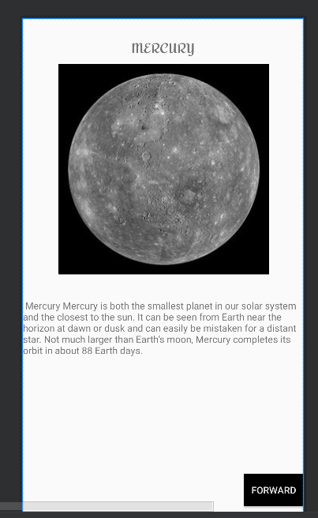
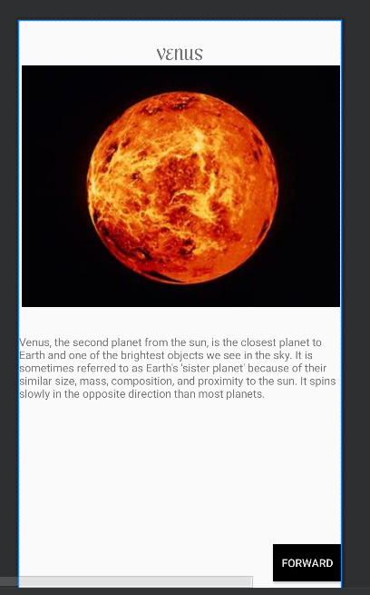
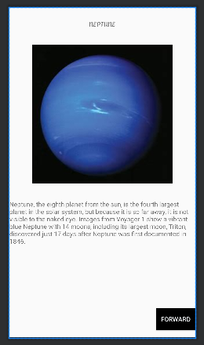

# AndroidStudios-Planet-App

## Description
This Android application, named "Planet App," serves as an informational guide about planets in space. Users can navigate through different planets by clicking the "Next" button, which opens a new page displaying a header, picture, and detailed information specific to each planet.

## Screenshots/GIFs

## Features
- Information about various planets in space
- Navigation through planets using the "Next" button
- Individual pages with headers, pictures, and detailed planet-specific information

## Technologies Used
- Android Studio
- Java/Kotlin

## Installation
To run this project locally, follow these steps:
1. Clone the repository:
Open the project in Android Studio.
Build and run the app on an emulator or a physical Android device.
Usage
Once the app is running:

Click the "Next" button to navigate through different planets.
Explore each planet's detailed page containing a header, picture, and specific information.
